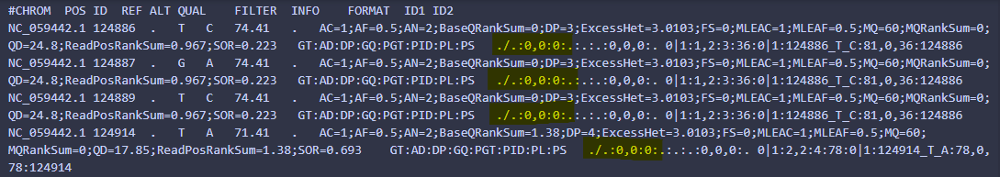
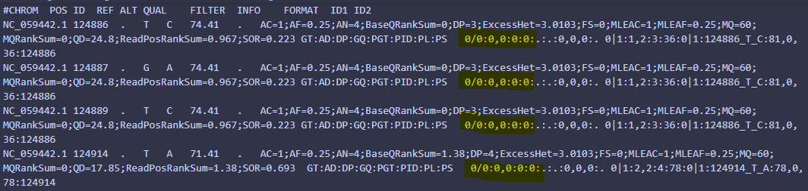

## GATK4 Version Change: Missing Data Representation
In a [blog post](https://gatk.broadinstitute.org/hc/en-us/articles/6012243429531-GenotypeGVCFs-and-the-death-of-the-dot) in 2022, Broad Institute announced a significant departure 👋 from standard Variant Call Format (VCF) [specifications](https://samtools.github.io/hts-specs/VCFv4.3.pdf). This blog post only came about some months after the change and following some querying on the GATK forums by some users who started noticing concerning VCF outputs. However, it wasn't until 2024 and a fortuitous Twitter post that widespread controversy erupted in the GATK user community. The change involves how missing genotyping calls are reported: instead of the traditional "./." designation, they now use "0/0" with a depth field (DP) of 0.

Adding fuel to the fire 🔥 this change was apparently introduced in GATK4 version 4.2.3.0, released on November 3, 2021 😱 while it would appear a lot of users were still unaware of this change in 2024. Although it was mentioned in the changelog/[release notes](https://github.com/broadinstitute/gatk/releases/tag/4.2.3.0) at the time, the clarity of this crucial alteration is questionable 😵‍💫 and probably goes a long way to explaining while it took so long for the community to understand. This departure from VCF specifications, has the potential to disrupt downstream tools and analyses. Maybe even more concerning is the shift from "./." to "0/0" can easily go unnoticed, leading to erroneous results.

This repository serves to demonstrate and confirm that the transition from "./." to "0/0" indeed occurred in GATK4 version 4.2.3.0, while version 4.2.2.0 retains the traditional behaviour.

### Dataset and Setup
For this demonstration, I utilised the Atlantic salmon 🐟 genome reference (Ssal_v3.1 [GCA_905237065.2](https://www.ncbi.nlm.nih.gov/datasets/genome/GCF_905237065.1/)) because lets face it this change has been a little 🐟eeee. I also grabbed some Atlantic salmon Illumina sequencing reads 🧬 from the NCBI BioProject [PRJNA922194](https://www.ncbi.nlm.nih.gov/bioproject/PRJNA922194), specifically SRR23029219 and SRR23029220.

- For computational efficiency and generate a reasonable number of regions with zero coverage (missing genotype calls), the fastq files were subsetted to 50k reads using [seqtk](https://github.com/lh3/seqtk). Additionally, only chromosome 1 (NC_059442.1) was used as the reference.
The following steps were orchestrated by a custom Nextflow pipeline
- Mapping of sequence reads to the genome was with BWA-MEM.
* Docker container 🐋 quay.io/biocontainers/mulled-v2-fe8faa35dbf6dc65a0f7f5d4ea12e31a79f73e40:219b6c272b25e7e642ae3ff0bf0c5c81a5135ab4-0
- Genotypes were called using GATK4, specifically through the pipeline: haplotypecaller → genomicdbimport → genotypegvcf. Two different Docker images were used to test the GATK4 versions:
* GATK 4.2.2.0 🐋 public.ecr.aws/biocontainers/gatk4:4.2.2.0--hdfd78af_1
* GATK 4.2.3.0 🐋 public.ecr.aws/biocontainers/gatk4:4.2.3.0--hdfd78af_1

### Verification
Upon inspection of the resulting VCF files, it is evident that version 4.2.2.0 maintains the convention of labelling missing genotypes as "./.", while version 4.2.3.0 adopts the new GATK representation, labelling missing genotypes as "0/0".

VCF produce by GATK 4.2.2.0 👇✅

VCF produced by GATK 4.2.3.0 👇❌

This confirmation underscores the importance of understanding version-specific changes in tools like GATK4 and highlights the potential impact on downstream analyses and interpretations. It is imperative for users to stay informed (Broad I'm looking at you) about such modifications to ensure the accuracy and reliability of their genomic analyses.

Lets hope 🙏 "./." is re-introduced into GATK4 soon, at least as optional flag.

👋 Shoutout if you want to add anything.

